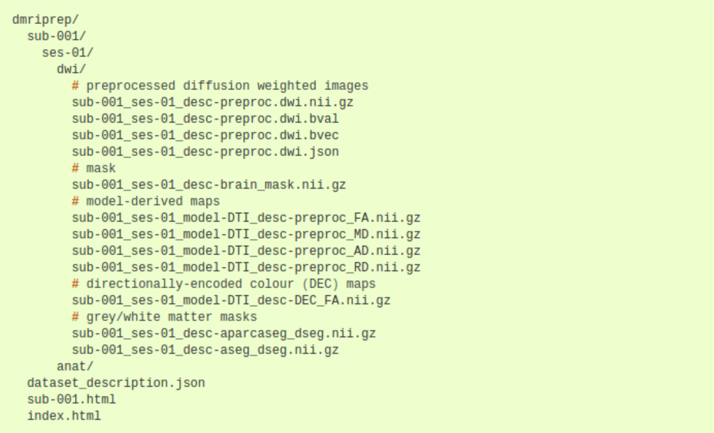
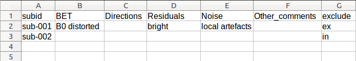
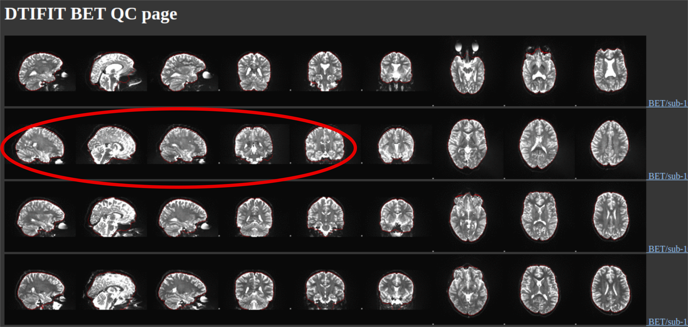
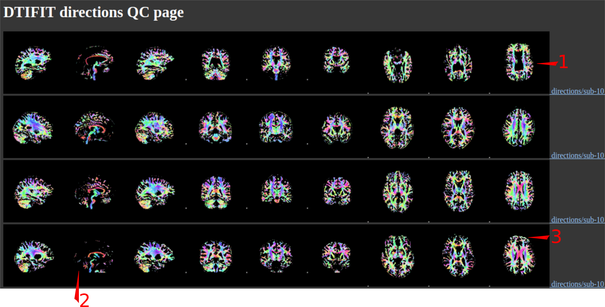
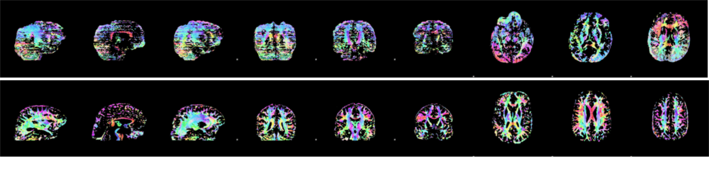
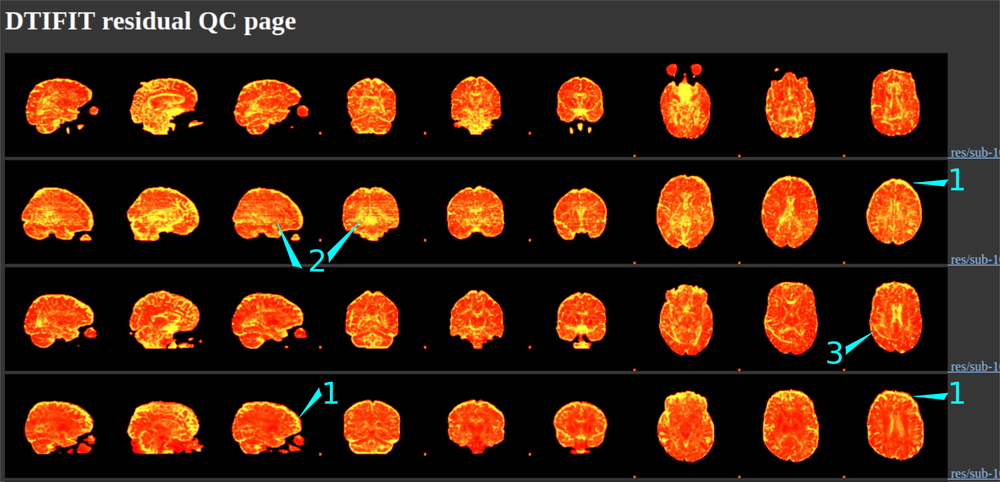
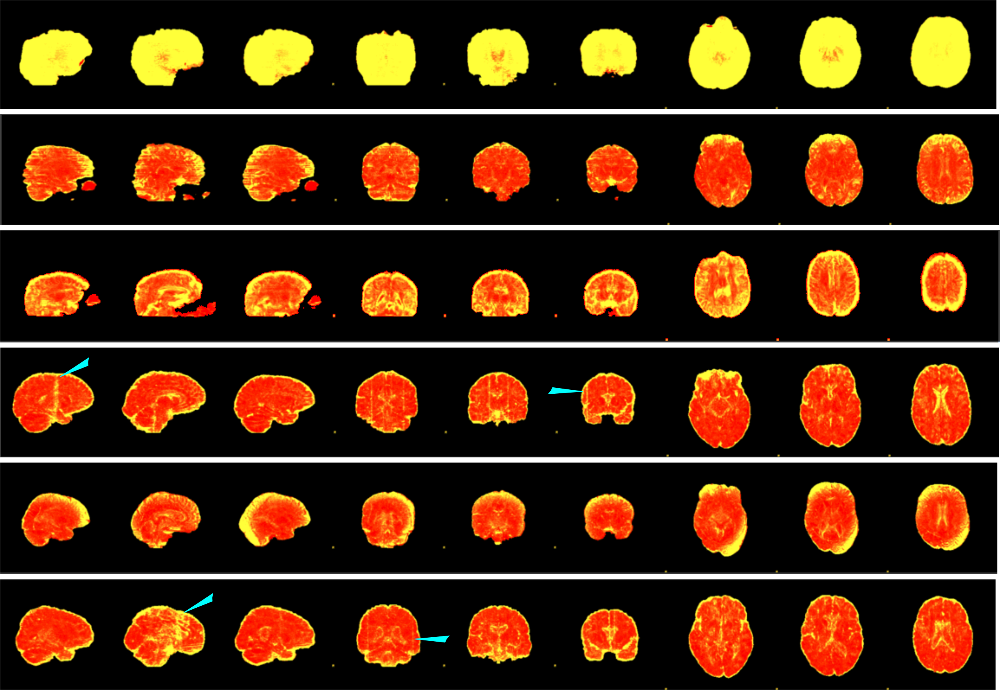

# TIGR LAB DWI QC

The purpose of this manual is to standardize quality control (QC) procedures for diffusion imaging acquisitions in the TIGR Lab. This manual will walk through the different aspects of the QC protocol.  
This protocol covers a two step QC process that will be completed on an analysis by analysis basis by the responsible researcher/scientist. It will be conducted on an analysis by analysis basis rather than study by study as inclusion/exclusion criteria may differ depending on the analysis methods to be implemented (e.g. local artifacts may not require exclusion depending on their location and what analysis or region is being investigated). QC ratings will be compiled by a staff member for each analysis of a particular dataset for posteriety and to reduce the unnecessary replication of work. i.e. If multiple people are working with the same dataset with similar methods they should use the same QC rating (ideally conducted by one person for consistency).  
  
  
The two step process involves:  

  1. __Visual QC__  
  2. __Quantitative QC__  
  
***  
## Step 0
Data collected by the TIGR lab and collaborators undergoes a first pass QC by staff on our dashboard as outlined [here](https://github.com/TIGRLab/documentation/wiki/QC---dashboard). This is a very liberal check, and so most of the data will be passed except for very extreme outliers of poor quality scans. These can be found in the archive. External data from open sources (e.g. HCP, PNC, ABCD) does not go through our dashboard but should have undergone a similar basic QC assessment before being released (this might vary drastically from study to study so check the release notes!). 

Once data is in the archive/external (or on SciNet for the open source data) it is preprocessed with dmriprep (Michael’s version). Documentation [here](https://dmriprep-personal.readthedocs.io/en/refactor/)! And Michael’s custom QC pipeline. Documentation [here](???)! Be sure to go through the documentation thoroughly to know every pre-processing step.

The output file system structure looks like this:  
{ width=75% }  


Once the QC script is run a `QC` directiory will be present in the `dmriprep` directory. This will contain the html files you need for visual QC.  

***  
## Step 1. Visual QC  
Before beginning to QC you should set up a csv file to note artifacts on the different visual QC images, as well as, the final inclusion/exclusion decision. Here's a link to a [template](https://github.com/nat-tigr/DWI_QC/blob/master/template_for_visual_QC.csv) and an example of the kind of comments you might make. I like to use "in" and "ex" under the `exclude` (decision) variable instead of numbers so there can be no confusion.    
  
{ width=75% }  
<br></br>  

The QC pipeline creates various html pages with a selection of 9 images (3 from each orthogonal direction) for each subject from the dataset. This makes it easy to scroll through and look for artifacts and processing errors.  
Four htmls are created:  

  1. BET  
  2. directions  
  3. residuals  
  4. noise  

You can open them from the terminal with ```google-chrome qc_BET.html``` etc  

***    
### 1.1 BET  
The BET images show the average B0 following image processing along with the edge of the brain mask overlaid in red. The primary objective of this visual step is to __check that the brain extraction was accurate__. The mask should follow the outline of the brain not excluding any brain matter or including any non brain matter. Very bad quality datasets will also be evident. Below are some examples. Often brain extraction isn’t good due to a bad quality scan but sometimes the data is good and useable but it needs to be reprocessed with a different extraction value to correct the brain extraction.  

<br></br> 
{ width=100% }  

The html pages will look like this with the subject number at the side. In the above example I've circled some slices where the B0 is distorted. It's clear on the sagittal and coronal slices but not the axial slices (due to the way the data was collected). Below are some more examples of highly distorted B0s.  

<br></br> 
{ width=100% }  
  
Gross artifacts are present in all the slices within the red box. The red arrows highlight some areas where the brain extraction is bad (likely due to the very poor image quality in this case). The red elipsoid shows where brain extraction has failed to fully exclude the eye balls.  

The examples below show where accurate brain extraction frequently fails and includes non-brain matter. But this shouldn't cause a problem for processing.  

{ width=75% }   
  
***
### 1.2 Directions  
The directions image intensity corresponds to the FA values with the colours encoded by the primary diffusion direction (eigenvector, L1 [λ1] from DTIFIT; red = L-R, blue = A-P, green = S-I). Bad images are generally easily identifiable by screwed up looking colours or rims as highlighted below.  
<br></br>  
{ width=100% }  

This is what the direction images look like.  

  1. The ventricles will appear black. Some people just have large ventricles. How it looks will also vary dependent on the head position in the scanner so the _same_ slice may not show the same bit of brain across subjects   
  2. This should be the mid-sagital slice but again depending on the head position in the scanner there's quite a lot of variability in how these look. i.e. sometimes very black if the subject is well centred. The red of the corpus callosum should always be nicely clear. And if you're lucky the green of the fornix and the blue of the spinal cord.  
  3. This is an artifact! These bright rims around the outside of the brain are the most common artifact in the direction QC. This one is quite mild.  

<br></br> 
{ width=100% }  

This is what it looks like when they're really bad.

***  
### 1.3 Residuals  
Residual images are the sse (sum of squares error) from the tensor model fit (generated with DTIFIT). We threshold and colour the image red (low)  to yellow (high) on a study by study basis. The optimal threshold to use is calculated in the DWI QC script. Ideally the residuals are low across the whole image. CSF will always be higher though (yellow). This is particularly relevant to note if your subjects are older or from certain clinical populations (e.g. Schizophrenia). These residual images are very useful for identifying local artifacts as well as the generally all round bad scans. More yellow is bad. And sometimes the whole image will be yellow (exclude). Some examples are highlighted below.  
<br></br>  
{ width=100% }  

  1. Some examples of bright rims that are common artifacts dentifiable with the residual images 
  
  2. This strippy kind of pattern will also be evident in high movement scans 
  
  3. This is a hardware artifact. Normally most prominent on the axial slices and smoothly curved.  
<br></br> 

{ width=100% }  
  
  
These are some examples of subjects to exclude. The blue arrows indicate some local artifacts (depending on where these artifacts are/ how subtle they are and what kind of analysis you're doing you may or may not want to exclude).

***  
### 1.4 Noise  
Noise images are generated with the dwidenoise command with the -noise flag. As you could imagine, this is an image which indicates how noisy the data in the brain image is. Similar to residuals, the images are thresholded and coloured red (low) to yellow (high) on a study by study basis, based on an optimal threshold which is calculated by lab experts and included in the DWI QC Script. Noise should be low and consistent across the whole image. Noise images, much like the residuals above, are very useful for identifying local artifacts as well as overall bad scans. In contrast to the residuals artifacts in the noise images will often appear as red rather than yellow. Some examples are highlighted below.  
<br></br>  


__ADD MORE FIGURES__


***  
## Step 2. Quantitative QC  
This step incorporates quantitative metrics of quality to supplement the visual QC. __Failing either visual or quantitative QC should result in exclusion__.  

The quantitative QC is based on output metrics from eddy (or recalculated measures if bias correction is implemented following eddy). These include:  

  1. __Contrast to noise ratio (CNR)__: High CNR means there is good contrast between different brain tissues.  
  2. __Signal to noise ratio (SNR)__: The signal in a voxel divided by the standard deviation of the signal across a region outside the brain. High SNR means a good signal with low noise.  
  3. __Average relative motion__: This is the average of the motion between each pair of consecutive volumes. You want as little motion as possible!  
  4. __Average absolute motion__: This is a metric of how much motion there is within the whole scan.  
     + A caveat with this is when scans are concatenated. Some protocols break their scan into separate runs (within the same session) and then merge them together for processing & analysis as if it was one scan. Absolute motion may therefore be superficially increased due to movement between scans.  
  5. __Total outliers__: The number of outlier slices per volume is calculated then averaged across all volumes. Lower the better.  

<br></br>
All these measures are gathered for the whole sample in one csv file after the QC script is run (you can find this in the QC directory too). Here's what it looks like:  

{ width=100% }  
<br></br>
To do the quantitative analysis you simply need to run our quantitative QC script (located ----------------) with the path to your csv file which is named STUDYNAME_eddy_metrics.csv.  
<br></br>  
`module load R`  
`cd /path/to/your/study/dmriprep/QC/`  
`Rscript /path/to/script/Quant_QC_DWI.R STUDYNAME_eddy_metrics.csv`  
<br></br>
This will produce a html report with details about your study data and the subjects that were outliers (and on what metric). Additionally the script produces a new csv file with the quantitative QC _decision_ as a variable (`Quant_QC_2SD`). The 2SD reflects the 2 standard deviations used to determine outliers.  


 
  

***

<br></br> 


